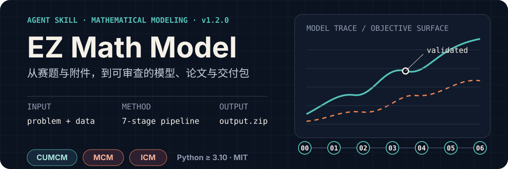

<p align="center">
  
</p>

<p align="center">
  <a href="./README.en.md">English</a> ·
  <a href="./STAR_MAP.md">技能星图</a> ·
  <a href="#安装">安装</a> ·
  <a href="#七阶段工作流">工作流</a> ·
  <a href="#交付内容">交付内容</a>
</p>

**EZ Math Model** 是面向数学建模竞赛与课程项目的 Agent Skill。把题面和数据附件交给 Codex 或 Claude Code，它会沿固定的七阶段流程完成题目解析、建模、Python 求解、论文撰写、质量审查与标准打包。

适用于 CUMCM、MCM/ICM、研究生数学建模竞赛，以及具有多小问、数据附件和论文交付要求的课程建模任务。

## 一次运行会得到什么

```text
赛题 + 数据附件
      │
      ▼
题目解析 → 建模方案 → Python 求解 → 图表与结果 → 论文 → 质量审查
      │
      ▼
output.zip
├── output/source code/
├── output/paper/paper.md
├── output/paper/paper.docx
├── output/paper/paper.txt
├── output/paper/paper.pdf
└── output/附件文件夹/
```

这不是只生成一段答案的提示词。Skill 会创建独立的 `runtime/` 保留中间证据，并通过 staging、对象级导出审查和 manifest 一致性检查发布最终 `output/` 与 `output.zip`。

## 核心能力

| 环节 | 真实能力 |
| --- | --- |
| 输入理解 | 读取 PDF、DOCX、Markdown、CSV、XLSX 与混合附件；识别赛事、年份、题号、小问和输出语言 |
| 建模与求解 | 从优化、预测、评价、图论、统计、综合建模、机器学习算法库选择方案，并编写、执行 Python 脚本 |
| 图表与论文 | 生成结果表与图表，执行 chart manifest 质量门；按中文或英文模板组织论文 |
| 写作编排 | 内置 PaperOrchestra 子 Skill，用于大纲、文献、章节成文与精修 |
| 质量审查 | 检查图文绑定、公式、表格、模板残留、工程痕迹，以及 DOCX/PDF 中的图片、公式和表格对象 |
| 可追溯交付 | 区分 `formal`、`demo`、`blocked`；使用 staging 原子发布并核对 `output/`、manifest 与压缩包 |

缺少关键附件时，Skill 不会静默合成数据并冒充正式结果：

- `formal`：真实输入齐全，可生成正式结论。
- `demo`：用户明确允许示例或合成数据，仅用于验证流程。
- `blocked`：缺少关键输入且未授权 demo，停止并输出诊断。

## 安装

### Codex

```powershell
gh skill install woodfishhhh/EZ_math_model skills/ez-math-model --agent codex --scope user
```

### Claude Code

```bash
gh skill install woodfishhhh/EZ_math_model skills/ez-math-model --agent claude-code --scope user
```

本机已有旧版本时，加 `--force` 覆盖：

```powershell
gh skill install woodfishhhh/EZ_math_model skills/ez-math-model --agent codex --scope user --force
```

要求：Python `>= 3.10`。Pandoc、MinerU、LibreOffice、OpenAlex 和 Semantic Scholar 等均为按需启用的可选工具。

## 第一次成功运行

1. 新建一个项目总文件夹。
2. 将题面、要求、补充说明和数据附件放入 `用户输入/`。
3. 在这个项目总文件夹中打开 Codex 或 Claude Code。
4. 连同题面与附件一起发送：

```text
用 ez-math-model 做这道数学建模题。
```

首次运行会先完成 setup gate。永久工具决策只在用户确认后写入；如果仅使用本次临时默认，最终状态最高为 provisional。

运行目录会整理为：

```text
项目总文件夹/
├── 用户输入/             # 题面、数据、需求与补充说明
├── runtime/              # 每次运行的中间产物、状态与审查证据
├── output/
│   ├── source code/
│   ├── paper/
│   │   ├── paper.md
│   │   ├── paper.docx
│   │   ├── paper.txt
│   │   └── paper.pdf
│   └── 附件文件夹/
└── output.zip            # 面向用户的最终交付包
```

## 七阶段工作流

下列路径均相对 `skills/ez-math-model/`。

| # | 阶段 | 契约文件 | 关键产出 |
| ---: | --- | --- | --- |
| 00 | Setup + 环境检查 | [`pipeline/00-environment-setup.md`](./skills/ez-math-model/pipeline/00-environment-setup.md) | setup 状态、环境检查、标准目录 |
| 01 | 题目解析 | [`pipeline/01-problem-intake.md`](./skills/ez-math-model/pipeline/01-problem-intake.md) | `problem.md`、`intake.json`、`run_state.json` |
| 02 | 建模方案 | [`pipeline/02-modeling-plan.md`](./skills/ez-math-model/pipeline/02-modeling-plan.md) | `modeling_plan.md` |
| 03 | 代码求解 | [`pipeline/03-coding-solve.md`](./skills/ez-math-model/pipeline/03-coding-solve.md) | Python 源码、结果表、图表、chart manifest |
| 04 | 论文撰写 | [`pipeline/04-paper-writing.md`](./skills/ez-math-model/pipeline/04-paper-writing.md) | `paper.md` |
| 05 | 质量审查 | [`pipeline/05-quality-audit.md`](./skills/ez-math-model/pipeline/05-quality-audit.md) | `quality_report.json`、`quality_report.md` |
| 06 | 打包交付 | [`pipeline/06-packaging-output.md`](./skills/ez-math-model/pipeline/06-packaging-output.md) | 四格式论文、manifest、`output.zip` |

想了解角色、算法库与子工具之间的完整关系，请查看 [技能星图](./STAR_MAP.md)。

## 交付内容

正式交付不只检查“文件是否存在”。质量门还会核对：

- 图表是否全零、全相等、平线、坐标压缩、不可读或语言不一致。
- 论文中的图片、公式和表格是否与导出 DOCX 对象对应。
- PDF 是否使用了低保真的 text-only fallback。
- `output/manifest.json` 中的验证状态是否有质量审查证据。
- staging 中的输出、最终 `output/` 与 `output.zip` 是否一致。

最终公开给用户的主交付物是项目根目录的 `output.zip`；`runtime/{task_id}/` 保留该次运行的诊断、审查与中间产物，便于定位失败和重试。

## 仓库结构

```text
EZ_math_model/
├── README.md
├── README.en.md
├── STAR_MAP.md
├── package.json
├── marketplace.json
├── manifest.json
├── VERSION
└── skills/ez-math-model/
    ├── SKILL.md             # Skill 主入口
    ├── pipeline/            # 七阶段流程契约
    ├── prompts/             # coordinator / modeler / coder / writer
    ├── references/          # 算法库、角色守则、运行协议
    ├── templates/           # 中英文论文与工作目录模板
    ├── tools/               # 文档、检索、写作与编排子 Skills
    ├── scripts/             # 安装检查与运行时脚本
    └── external/            # 可选外部资料与用户 corpus
```

运行时密钥使用 `EZMM_` 前缀的环境变量，不写入仓库。用户项目的运行文件写入项目总文件夹，而不是 Skill 安装目录。

## 社区

QQ 交流群：`1106854834`

<p align="center">
  
</p>

## 许可

[MIT](./LICENSE)
